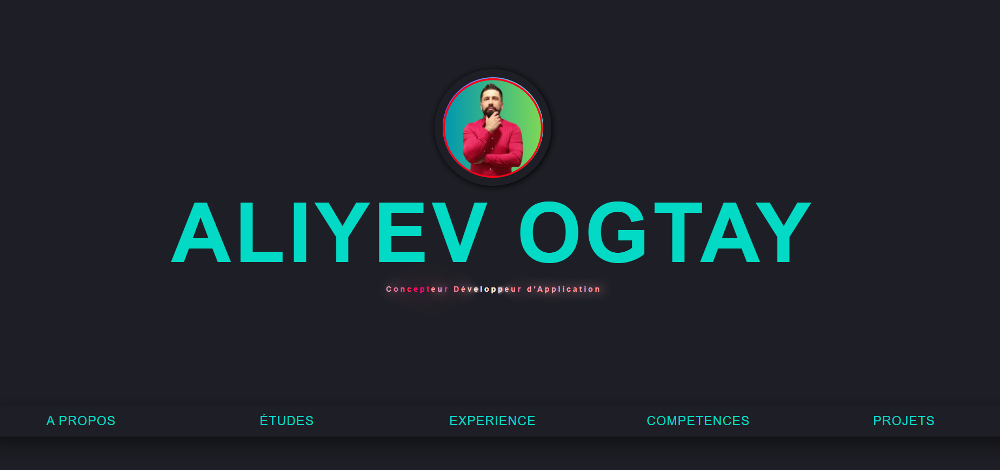

# CV Responsif
# Live vision :https://ogtayaliyev.github.io/CV-Responsif

Ce projet est un CV en ligne conçu pour être responsive, offrant une expérience utilisateur optimale sur une gamme de périphériques, des ordinateurs de bureau aux smartphones.

**Aperçu**

**Fonctionnalités**
Responsive Design : Le CV s'adapte de manière fluide à différentes tailles d'écran pour une visibilité et une lisibilité optimales.
Informations Dynamiques : Les sections du CV sont dynamiques, permettant une mise à jour facile des informations sans modifier le code source.
HTML5 & CSS3 : Le CV est construit en utilisant les dernières normes HTML5 et CSS3 pour garantir une compatibilité maximale et des performances optimales.
Section Projets : Une section dédiée aux projets permet de mettre en valeur les réalisations passées avec des descriptions détaillées et des liens pertinents.
CV Téléchargeable : Les utilisateurs peuvent télécharger une version PDF du CV pour une consultation hors ligne ou pour l'impression.
Utilisation
Clonage du Référentiel : Clonez ce référentiel sur votre machine locale en utilisant la commande suivante :
bash

**[git clone https://github.com/votre_nom/cv-responsif.git](https://ogtayaliyev.github.io/CV-Responsif/)**

Personnalisation : Remplacez les informations de démo par vos propres détails, y compris votre expérience, votre éducation, vos compétences et vos projets.
Visualisation Locale : Ouvrez le fichier index.html dans votre navigateur web pour visualiser votre CV localement et assurez-vous que tout s'affiche correctement.
Déploiement : Si vous souhaitez rendre votre CV accessible en ligne, vous pouvez le déployer sur une plateforme d'hébergement statique comme GitHub Pages ou Netlify.
Contributions
Les contributions sont les bienvenues ! Si vous souhaitez améliorer ce projet, n'hésitez pas à soumettre une demande de tirage (pull request) avec vos modifications.

**Support**
Si vous rencontrez des problèmes ou avez des questions, veuillez ouvrir un problème (issue) dans ce référentiel et nous serons heureux de vous aider.

**Licence**
Ce projet est sous licence MIT. Pour plus d'informations, veuillez consulter le fichier LICENSE.
